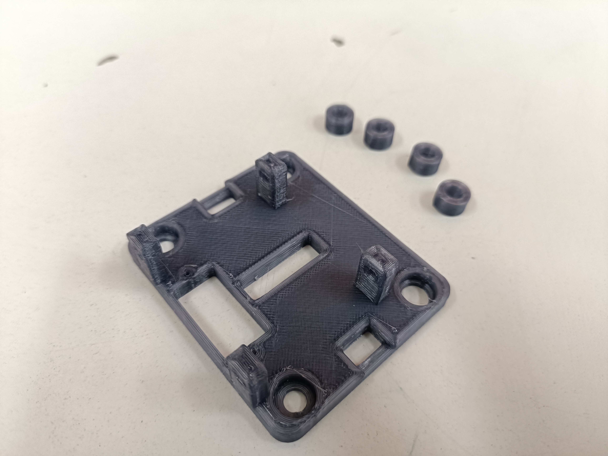

# Finding Inspiration

Youtube. Search, "How to build a pen plotter". Found a couple videos:

- [https://youtu.be/WgsTyhX311E?si=pykW71T5uxcJOCAv](https://youtu.be/WgsTyhX311E?si=pykW71T5uxcJOCAv)
- [https://youtu.be/CW3tCkms7oM?si=zcMRKgs8F6E5Ye7R](https://youtu.be/CW3tCkms7oM?si=zcMRKgs8F6E5Ye7R)

Then I found a corresponding instructable:

- [https://www.instructables.com/DIY-Homework-Writing-Machine-Using-Arduino-2D-Pen-/](https://www.instructables.com/DIY-Homework-Writing-Machine-Using-Arduino-2D-Pen-/)

# Gathering Materials

Thankfully, the instructable had a Bill of Materials: [https://docs.google.com/spreadsheets/d/1K6GGZx7ZxFlsE_SG4vm4hw3O7Y4HbJr1x2MOWS65IPo/edit?usp=sharing](https://docs.google.com/spreadsheets/d/1K6GGZx7ZxFlsE_SG4vm4hw3O7Y4HbJr1x2MOWS65IPo/edit?usp=sharing).

Since it was my first time, I had no clue why we needed all these parts. I compiled a shopping list, keeping some nuts and bolts as extras.

With the help of lab staff, I gathered:

**Mechanical Parts**:
+ GT2 Timing Belt
+ GT2 Pulleys (20 teeth 5mm bore)

**Electrical Parts**:
+ Arduino Cable

**Nuts & Washers**:
+ M3, M4, M5 Hex nuts
+ Random washers

Then I went down to Chawri Bazaar to get what I needed. It was really tough to source loose pieces of things I needed in this wholesale market. It wasn't difficult to find people who had things, it was simply impossible to buy < 100-500 qty. packs of each item.

However I found one shop which allowed me to get bolts if I bought at least 10 of each. From here I got:

**Bolts:**
+ M3 12mm, 16mm
+ M4 12mm, 16mm
+ M5 12mm, 16mm, 20mm, 45mm

**Nuts:**
+ M5 Nyloc Nuts

Tried very hard to find Aluminium V-slot extrusions (2020, 2040). All the shops near Ajmeri Gate and Paharganj were again wholesalers, so they needed you to buy at least 15ft of any item.

So I ordered these from amazon:
+ 2020, 2040 V slot extrusions (500 mm)
+ M4 Sliding Nuts
+ Openbuilds POM wheel kits (bigger ones)

Later, I visited Lajpat Rai Market to source electronics. As per lab staff's recommendation, Bonus Electronics had everything I needed at quite a reasonable price! From here I got:

+ Arduino Uno R3
+ CNC Shield V3
+ Short-circuit jumpers for the shield
+ NEMA 17 4.2 kg-cm Stepper Motors
+ DRV 8825 Stepper Drivers
+ 12V 2A DC Adapter

Make sure you also buy a USB cable for your Arduino if you don't have one!

### Update: (More Shopping)

1. The steppers had different connectors than intended, had to buy a fresh set online from [robocraze.com](https://robocraze.com).
2. The stepper drivers weren't giving a Vref reading, got a pair of A4988 and DRV8825 (just incase) from [roboticsdna.in](https://roboticsdna.in).
3. Similarly ordered: 3D printer springs, Idler pulleys, M5 sliding nuts.
4. Bought two cheap click pens for their springs.

## Substituting materials

The instructable used button head bolts, but I had bought allen head (hex) bolts. Upon reviewing the build process, I realised this didn't matter.

For the POM wheels, I'd need low-profile bolts. These have heads that don't jut out of the surface of the hole they're in, allowing you to put whatever on top. I later realised these would come with any POM wheel _kit_ that I bought!

### Update:

#### Low profile bolts and spacers

I needed long (45mm) M5 low profile bolts, the ones that came with the wheels are much shorter. Thankfully, I have M5 45MM bolts (allen heads), so I made space for these in my CAD design for the gantry plate of the 2040 V slot.

The wheel kits also had only one spacer each. I'd need two spacers for the wheels in the 2040 gantry, so I'll just use M5 nuts as spacers for now.

#### 3mm rods for pen lifter

Couldn't find these. Possible alternatives:
- Cut a long 3mm wide nail
- Cut 3mm allen keys

I ended up using the springs and refills from those clicky ball pens. The refills were 3mm wide and the spring was roughly 4mm so they did the job.

# CAD

## Initial Design

As I went throught the video above, I started reverse engineering the design on CAD, since my submissions required STEP files.

It took me two nights, and a lot of guesstimating + calliper use to finally come up with the [STEP](https://github.com/shivamkedia17/plotter/tree/main/step-files) / [STL](https://github.com/shivamkedia17/plotter/tree/main/stl-files) files that can be found in my repository.

It wasn't that difficult to eyeball the widths of the bigger parts (feet for e.g). For the finer parts like the Arduino Holder, Pen lifter (using the servo wing), NEMA 17 mount and Idler mounts it was easy to find STEP files for these parts themselves, and with the help of CAD assemblies, I referenced these parts and tried to make accurate designs.

I had already received most of the materials ordered, and having a list of parts was helpful. For the holes, I just referred to my inventory and inferred which bolts would go where.

The pen lifting mechanism was the most time taking. I had to sketch out surfaces in almost all planes,split bodies and drill precise holes. I assumed three general widths for the clip:
- your average parker jotter (small ~6mm diameter),
- the click pen with rubber grips (medium ~9 mm diameter)
- and the whiteboard marker (large ~13mm diameter).

## Test Printing

Just to be sure my designs were fine and the tolerances weren't bad, I carried out a set of test prints. They were quick skins of the actual parts, just to ensure the cutouts were correctly placed and that there wasn't anything obvious that I missed. Here's what they looked like:

I realised the pen clip was much smaller than expected so I had to revise it.

Also, my designs didn't accomodate the wider (7mm) head of the eccentric spacer that would sit flush with the bottom surface of the x-axis' top gantry plate. So I made holes for these.
The M5 bolts had a roughly 10mm wide head which was also 2.5 mm long (since I couldn't find the low profile versions that were 45mm long). I ended up having a wider, shallower holes on the top of the x-axis gantry so that bolt heads could sit flush on the top plate.

## Updating Designs

After test printing, I realised the pen clip was much smaller than expected so I had to revise it.

Later while assembling the x-axis (2040 V slots) I realised that the holes for the wheels' bolts was ever so slightly closer than needed. This was likely because I didn't know that I would need to keep a couple millimeters of tolerance and they completely choked the aluminium extrusion and would refused to slide.

Something similar happened with the y-axis. The wheels across the profile were really tightly placed, and because of simple print artefacts and shrinkage, there wasn't enough space left for the eccentric nuts to do their job. Plus, I had totally forgotten that the wheels would need to be far apart enough on the same side to accomodate the servo that would be screwed onto the gantry.

# During Assembly

## Orientation of the 2040 gantry
While trying to reverse engineer the design of the machine from youtube, I realised the M5 holes were supposed to go on the top plate since the 2020 profile would be installed on top of the 2040 (and not below). Nevertheless, since this had no dependencies, I simply flipped the gantry and used the bottom plate as the top and vice versa.

## Attaching the 2020 on the 2040 gantry
Since the 2020 profile was to be installed on top of the 2040, I had to disassemble the 2040 plates and reassemble them. Had to keep in mind the position of the timing belts on the 2040 profile (since they would be on the channel closer to the motor), so that required assembling the gantry with the belt cutouts and the M5 holes for the 2020 accordingly.

## Smooth Movement of the Gantry

### Tensioning the belts properly
For the machine to be precise, it is imperative the timing belts are tensioned properly. So while zip-tying the belts on the gantry plates, I had to first move the motor and pulley on either side closer (using the sliding nuts) to the profile. This would ensure adequate tension on the belts since we have the option of sliding the motor and pulley away from the profile in case the belt has too much slack.

### Ensuring Smooth Movement of the Wheels
Besides having well-tensioned belts, it is also necessary that the wheels are neither too far away from the profile nor close enough to be jammed while moving.

Each wheel set comes with one round spacer and one *eccentric*. The eccentric spacers must be used to tune the wheels.

This boils down to having accurate CAD designs. I had to adjust my CAD designs multiple times:

+ I had kept a very tight 60mm of space between the centers of the wheels across the 2040 profile. After 3D printing, the parts shrunk a bit, and the wheels choked the profile and did not slide freely.

+ Ran into the same issue for the 2020 profile. This was worse because the gantry was a really small, thin part. Had to reprint the part twice, and it was still not a great fit.

+ The eccentric spacers on the 2020 profile could not be fine-tuned because I hadn't earlier considered that the designs needed enough spacer for the bolts to turn as the eccentric spacer was turned to tune to the wheels.
When actually tuning the wheels, they consequently started to get wonky (since the bolts were now slightly crooked instead of being perpendicular to the 2020 gantry).

+ I resorted to a quick-fix by using the round spacer on both sides of the 2020 gantry. This however wasn't great because now there was some slack between the wheels and the 2020 profile, so when the servo moved the pen up and down, it caused some line artifacts in the drawing. This can be observed in the video demo.

## Wiring the steppers
The steppers must be wired in the correct way for them to work properly with the CNC shield. Due to the orientation of the clip, there was only one way to attach the female connector to the motors. However, there are two ways to attach them next to the drivers on the board. It takes one round of trial and error to figure out the correct orientation: if the motors grate when turned on, the wiring on the shield is incorrect; flip the connector and things become fine.

Also, while resetting the machine to (X0, Y0), the motors must be turned off. This requries switching off the wall adapter.

## Wiring the servo
The servo has a small cable which first has to be cut, soldered onto longer cables and extended. However, the servo has a 3-pin female connector. Out of the 3 pins, two are the + (red) and - (brown) for powering the motor, and the third is for the digital (yellow) connection. On the shield, the power and digital pins are in different locations so the 3-pin female connector cannot be conveniently used. I had to use male to female jumpers to make the appropriate connections.

# Machine Firmware

The machine runs GRBL (v1.1 in my case). One must learn how to compile and upload a library to the board, and how to power the Arduino + CNC shield (since they can both be individually powered or both can be powered via one of the two). In my case the USB connection powered the Arduino, whereas the wall adapter powers the CNC shield (which in turn power the stepper motors).

The machine basically takes G-Code files as input and draws whatever it's given. For this the machine firmware must be configured with the relevant settings for acceleration of the axes and the feed rate.

## Feed rate error on UGS

On UGS in case there's an error saying the feed rate is not set or undefined, it must be manually set using the console, the command for which is: `F1000` (in case you want the rate to be 1000, for example).

## G-Code and Images

To plot images, they must first be converted into G-Code files (which are then sent by UGS to the machine). While Inkscape is typically used for converting images to G-Code (compatible with the servo), the extensions were to be compiled using a 32-bit version of python2. So, for testing purposes I used [this GCode file](abc123ABC.gcode). This is an area of improvement.
